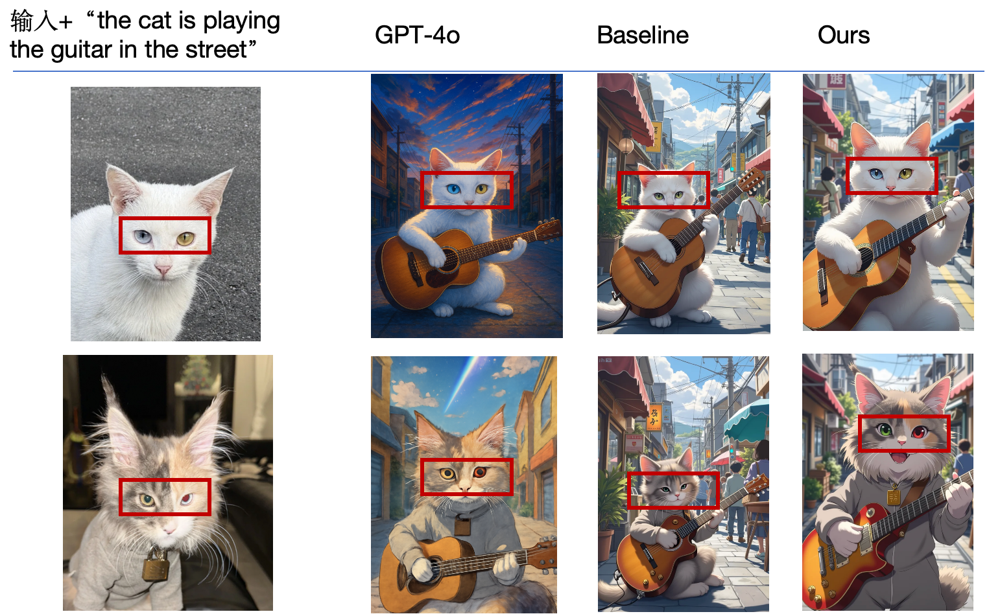

1. 按照REAMDE.md.old下载对应基模型和lora
2. 下载joy-caption 进行图像打标：https://huggingface.co/spaces/fancyfeast/joy-caption-alpha-two
3. 下载BiRefNet 进行背景移除：https://huggingface.co/ZhengPeng7/BiRefNet
4. 运行run_infer.py

结果比较：

